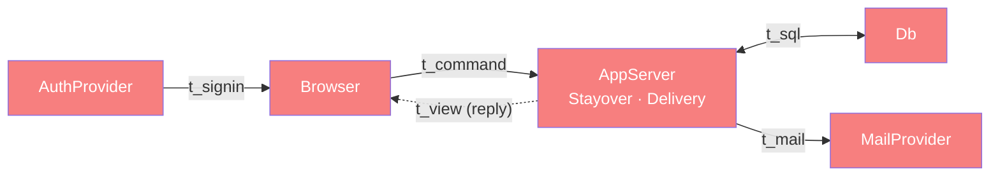

# Whole-system categorical map (Dat/Trn/Loc/Trm)

> Top-level architecture doc (FRAMEWORK §4). Names the four atoms, lists components
> (each linking to its ARCHITECTURE.md), reifies placement where it is a relation,
> and runs the §4.5 coherence checklist. Detail lives in the linked component docs.
> Source of record: the component ARCHITECTURE.md files — greenfield, no code yet.

## 1. Why

lyanne-visa is a small client–server app (§7.2) with a hexagonal edge (§7.4): a
family negotiates stayover dates for a child, and confirmed stays flow out to
inboxes and calendars. Modeling it categorically buys three concrete things here:
the negotiation collapses into one append-only move log from which status, turn
and agreed dates are *deduced*; invitations, templates and counter-offers collapse
into existing objects instead of spawning parallel ones (§3); and calendar events
are deduced from the agreed dates and delivered as email invites that update in
place, so no calendar state is stored and no calendar API is needed.

## 2. The four atoms (at a glance)

**Dat**

| Object | Shape | Authoritative at |
| --- | --- | --- |
| `Family`, `Member`, `Child`, `Place` (+ spans `Guardian`, `PlaceHost`) | tenant structure; `Member.m_user?` null = pending invite | `Db` |
| `Application` | child × place × `Move*` × `StayDetails` | `Db` |
| `Move` | kind × side × by × at × `dates?` × `note?` | `Db` (append-only) |
| `StayDetails` | care notes, handovers, flights, contacts; `templateName?` | `Db` |
| `Dispatch` | delivery audit: recipient, kind, revision, attempts, status | `Db` |
| `CalendarEvent`, `status`, `agreed?`, `revision` | — | **deduced**, never stored |

**Trn** (key ones)

| Trn | `t_from → t_to` | Component |
| --- | --- | --- |
| `validateMove` / `recordMove ⊸` | `MoveCmd → Move` | Stayover |
| `foldStatus` | `Move* → Status × agreed? × revision` | Stayover |
| `applyTemplate ⊸` | `StayDetails → StayDetails` | Stayover |
| `planDelivery` | `MoveCommitted → PlannedDispatch*` | Delivery |
| `dispatch ⊸` | `PlannedDispatch → Dispatch` (send via `Mailer`, bounded retry) | Delivery |

**Loc** — `Browser` (members' phones/computers), `AppServer` (Next.js on Vercel
serverless), `Db` (Supabase Postgres), `AuthProvider` (Supabase Auth: Google
sign-in + email magic link), `MailProvider` (v1: Gmail SMTP).

**Trm** — `t_command`/`t_view` (Browser ↔ AppServer), `t_sql` (AppServer ↔ Db),
`t_signin` (AuthProvider → Browser → AppServer), `t_mail` (AppServer →
MailProvider). `t_stayover_event` (Stayover → Delivery) is an
in-process port within one `AppServer` invocation — a same-Loc handoff, so it is a
`Trn` boundary between components, not a network hop.

## 3. Components

| Component | Owned `Trn` | Built/active when | Doc |
| --- | --- | --- | --- |
| `stayover` | invite/bind members, validate/record moves, fold status, overlap check, templates, render | always | [stayover/ARCHITECTURE.md](stayover/ARCHITECTURE.md) |
| `delivery` | plan delivery, build/render invites and notices, send via `Mailer` with bounded retry | after each committed Stayover event | [delivery/ARCHITECTURE.md](delivery/ARCHITECTURE.md) |

`depends-on`: `delivery → stayover` (reads `participants`, `calendarFacts`; triggered
by `t_stayover_event`). No edge the other way.

## 4. Placement (only where runsAt is a relation, §4.2)

| `Trn`/`Dat` | Placements | Why it matters |
| --- | --- | --- |
| `validateMove` | Browser, AppServer | client for UX, server authoritative |
| `checkOverlap` | AppServer, Db (exclusion constraint) | concurrent accepts cannot double-book |
| `authorize` | AppServer, Db (RLS) | tenant wall enforced by the DB |
| `foldStatus` | AppServer, Browser | optimistic view |
| `sendEmail` | AppServer→MailProvider (Gmail SMTP), console double | swappable provider behind `Mailer` |
| `Application` (Dat) | Db (authoritative), Browser (view copy) | §7.2 — never trust the copy |

## 5. Coherence checklist (§4.5 / §8) — against the *design* (no code yet)

- [x] 1. Placement honesty — every Trn's inputs are in `Db` or arrive by `t_command`/`t_view`/`t_stayover_event`.
- [x] 2. Transmission well-typing — every Trm names its `carries`; SMTP credentials never leave `AppServer`.
- [x] 3. Placement totality — every Trn above has at least one placement and an owning component.
- [x] 4. Dependency mediation — `delivery → stayover` goes only through the port and deduced views; the mail provider only through `Mailer`.
- [x] 5. Composition soundness — nothing re-described across components; shared Dat (`Member`, `Application`) owned by Stayover.
- [x] 6. runsAt is a relation — four multi-placed Trns declared in §4.

Re-run against code once built; until then these are design claims, not verified facts.

## 6. Modeling smells swept (§3)

No parallel objects: invitation ⊂ `Member`; template ⊂ `StayDetails`;
counter-offer ⊂ `Move`; approve ≡ accept; drop-off ≡ pick-up (`Handover` + kind);
roles deduced from `Guardian`/`PlaceHost`. Deduced, not copied: status, agreed
dates, calendar event, uid, sequence, attendees. One declared copy: template ↔ details
(snapshot semantics — see stayover rule 8).
