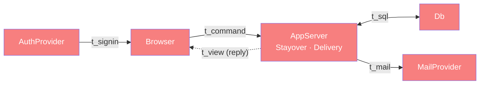

# Whole-system categorical map (Dat/Trn/Loc/Trm)

> Top-level architecture doc (FRAMEWORK §4). Names the four atoms, lists components
> (each linking to its ARCHITECTURE.md), reifies placement where it is a relation,
> and runs the §4.5 coherence checklist. Detail lives in the linked component docs.
> Source of record: the component ARCHITECTURE.md files — greenfield, no code yet.

## 1. Why

lyanne-visa is a small client–server app (§7.2) with a hexagonal edge (§7.4): a
family negotiates stayover dates for a child, and confirmed stays flow out to
inboxes and calendars. One deployment serves one family: people self-register as a
parent or a host — active at once with the family join code, otherwise on a
waiting list — and a configured admin account oversees accounts. Modeling it categorically buys three concrete things here:
the negotiation collapses into one append-only move log from which status, turn
and agreed dates are *deduced*; accounts, templates and counter-offers collapse
into existing objects instead of spawning parallel ones (§3); and calendar events
are deduced from the agreed dates and delivered as email invites that update in
place, so no calendar state is stored and no calendar API is needed.

## 2. The four atoms (at a glance)

**Dat**

| Object | Shape | Authoritative at |
| --- | --- | --- |
| `Member`, `Child`, `Place` (+ spans `Guardian`, `PlaceHost`) | accounts (one role each: parent or host), children, homes | `Db` |
| admin | predicate on the signed-in identity (admin list seeded at setup) — not family data | `Db` (config table) |
| `Application` | child × place × `Move*` × `StayDetails` | `Db` |
| `Move` | kind × side × by × at × `dates?` × `note?` | `Db` (append-only) |
| `StayDetails` | care notes, handovers, flights, contacts; `templateName?` | `Db` |
| `Dispatch` | delivery audit: recipient, kind, revision, attempts, status | `Db` |
| `CalendarEvent`, `status`, `agreed?`, `revision` | — | **deduced**, never stored |

**Trn** (key ones)

| Trn | `t_from → t_to` | Component |
| --- | --- | --- |
| `validateMove` / `recordMove ⊸` | `MoveCmd → Move` | Stayover |
| `foldStatus` | `Move* → Status × agreed? × revision` | Stayover |
| `applyTemplate ⊸` | `StayDetails → StayDetails` | Stayover |
| `planDelivery` | `MoveCommitted → PlannedDispatch*` | Delivery |
| `dispatch ⊸` | `PlannedDispatch → Dispatch` (send via `Mailer`, bounded retry) | Delivery |

**Loc** — `Browser` (members' phones/computers), `AppServer` (Next.js on Netlify
serverless functions), `Db` (Supabase Postgres), `AuthProvider` (Supabase Auth: Google
sign-in + email magic link), `MailProvider` (v1: Gmail SMTP).

**Trm** — `t_command`/`t_view` (Browser ↔ AppServer), `t_sql` (AppServer ↔ Db),
`t_signin` (AuthProvider → Browser → AppServer), `t_mail` (AppServer →
MailProvider). `t_stayover_event` (Stayover → Delivery) is an
in-process port within one `AppServer` invocation — a same-Loc handoff, so it is a
`Trn` boundary between components, not a network hop.

## 3. Components

| Component | Owned `Trn` | Built/active when | Doc |
| --- | --- | --- | --- |
| `stayover` | register accounts, add children/places and links, admin account management, validate/record moves, fold status, overlap check, templates, render | always | [stayover/ARCHITECTURE.md](stayover/ARCHITECTURE.md) |
| `delivery` | plan delivery, build/render invites and notices, send via `Mailer` with bounded retry | after each committed Stayover event | [delivery/ARCHITECTURE.md](delivery/ARCHITECTURE.md) |

`depends-on`: `delivery → stayover` (reads `participants`, `calendarFacts`; triggered
by `t_stayover_event`). No edge the other way.

## 4. Placement (only where runsAt is a relation, §4.2)

| `Trn`/`Dat` | Placements | Why it matters |
| --- | --- | --- |
| `validateMove` | Browser, AppServer | client for UX, server authoritative |
| `checkOverlap` | AppServer, Db (`for update` row locks, not an exclusion constraint — `stays` change task 1.2 deviation) | concurrent accepts cannot double-book |
| `authorize` | AppServer, Db (RLS) | visibility-by-side enforced by the DB |
| `foldStatus` | AppServer, Browser | optimistic view |
| `sendEmail` | AppServer→MailProvider (Gmail SMTP), console double | swappable provider behind `Mailer` |
| `Application` (Dat) | Db (authoritative), Browser (view copy) | §7.2 — never trust the copy |

## 5. Coherence checklist (§4.5 / §8) — design claims, partly verified against code

`stayover` has real code behind most of its rows (foundation + the `stays`
change: `Member`/`Child`/`Place`/`Guardian`/`PlaceHost`, `Application`/`Move`,
capacity — see `stayover/IMPLEMENTATION.md` and `stayover/STATUS.md` for the
row-by-row realisation). `delivery` is now built too (see
`delivery/IMPLEMENTATION.md` and `delivery/STATUS.md`) — the cross-component
edge (`delivery → stayover`) is realised differently than this map's original
sketch: rather than `stayover` handing `delivery` a live `t_stayover_event`
value, `stayover`'s own writing functions (`record_move`, `open_application`,
`delete_application`) and foundation's `register` insert `dispatch` rows
directly, inside the same transaction as the domain write
(`supabase/migrations/20260924001200_delivery_queue.sql`, justified in that
migration's header comment and `email-delivery`'s design.md Decision a). The
TS-level port `stayover` built (`src/stayover/events.ts`/`events.server.ts`,
`src/stayover/actions/stays.ts:emitStayoverEvent`) still fires (now redacted
of participant emails — logs `event.kind` only) but is not what `delivery`
actually reads; `delivery`'s own read of "which recipients, which facts" is a
`payload jsonb` snapshot taken by the same SQL functions, not a live query
against anything `stayover`-owned at send time.

- [x] 1. Placement honesty — every Trn's inputs are in `Db` or arrive by `t_command`/`t_view`/`t_stayover_event`. Verified in `stayover`: `validateMove` (Browser) never itself writes (`src/stayover/validateMove.test.ts`); `record_move` re-derives everything from `Db` inside its own transaction. Verified in `delivery`: `buildEvent`/`renderNotice`/`renderIcs` are pure functions over their argument only (`src/delivery/build-event.test.ts`, `render-notice.test.ts`, `render-ics.test.ts`); `sendPendingDispatches`' render/send/record are all injected dependencies (`send-pending-dispatches.test.ts`).
- [x] 2. Transmission well-typing — every Trm names its `carries`; SMTP credentials never leave `AppServer`. Verified in `delivery`: `mailer.test.ts`'s import-boundary test statically confirms `DELIVERY_SMTP_*`/`DELIVERY_FROM_ADDRESS` are read only in `mailer-smtp.ts` and `DELIVERY_WORKER_SECRET` only in `worker-secret.ts`.
- [x] 3. Placement totality — every Trn above has at least one placement and an owning component.
- [x] 4. Dependency mediation — `delivery → stayover` goes only through the (re-realised) outbox and deduced snapshot, never a live read back into `stayover`'s own tables at send time; the mail provider only through `Mailer`. Verified on the `stayover` side: no file under `src/stayover/` imports anything from `src/delivery/`. Verified on the `delivery` side: `src/delivery/` never imports Stayover's own `move`/`application` tables directly — `20260924001200_delivery_queue.sql`'s new functions read them only from inside `stayover`'s own writing functions, not from a `delivery`-owned function.
- [x] 5. Composition soundness — nothing re-described across components; shared Dat (`Member`, `Application`) owned by Stayover; `Dispatch`/`CalendarEvent` owned by Delivery.
- [x] 6. runsAt is a relation — four multi-placed Trns declared in §4. Verified in code for `validateMove` (Browser + AppServer) and `checkOverlap`/`authorize` (AppServer + Db) — see `stayover/IMPLEMENTATION.md`. `dispatch ⊸` also runs from two call sites (`after()` in server actions, the traffic-triggered fallback in `src/proxy.ts`) against the same pure loop (`sendPendingDispatches`), both wired through `sendPendingDispatchesFromRequest`.

`delivery`'s rows are now verified against code (this pass) — see
`delivery/IMPLEMENTATION.md`'s row-by-row realisation and
`delivery/STATUS.md`'s coherence section for the same Law-by-Law detail as
above, specific to `delivery`.

## 6. Modeling smells swept (§3)

No parallel objects: account = `Member` + role (no Parent/Host tables); admin is
a predicate, not an object; template ⊂ `StayDetails`; counter-offer ⊂ `Move`;
approve ≡ accept; drop-off ≡ pick-up (`Handover` + kind); side per application
deduced from `Guardian`/`PlaceHost`. Deduced, not copied: status, agreed
dates, calendar event, uid, sequence, attendees. One declared copy: template ↔ details
(snapshot semantics — see stayover rule 8).
