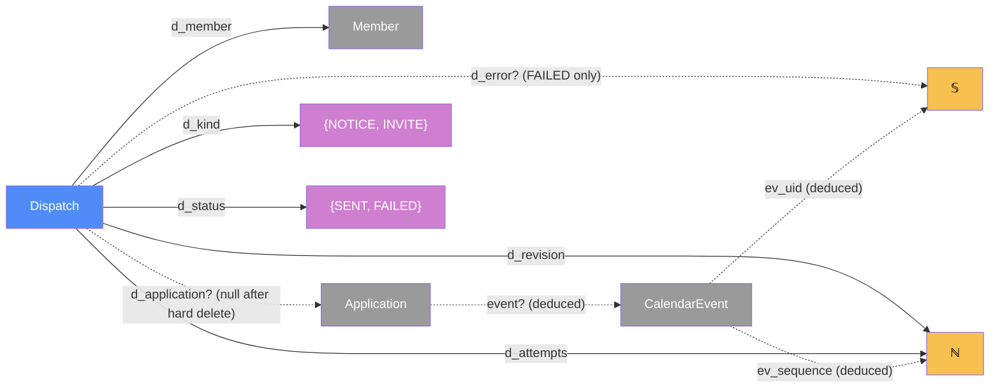

# Delivery — categorical model

> Model-first (FRAMEWORK §2/§4). Intended specification for this component; the
> code realises it (see IMPLEMENTATION.md). Source of record: this file — no code
> exists yet (greenfield). Revised 2026-09-23: calendar delivery is **email
> invites only** (O4 decided) — no Google Calendar API, no OAuth.

## 1. Overview

Everything that leaves the app for someone's inbox. When a Stayover event commits,
Delivery (a) emails the side whose turn it now is, and (b) when the agreed dates
change or a confirmed stay is cancelled, sends every participant an **iCalendar
invite** (`.ics`, `METHOD:REQUEST` / `METHOD:CANCEL`). The invite works with any
calendar — Google, Apple, Outlook — and later invites for the same stay update or
remove the same calendar event rather than adding a new one. Gmail adds invites to
the calendar automatically once the app's address is a known contact.

All mail leaves through one port, `Mailer`; v1's adapter is Gmail SMTP from a
dedicated app account.

## 2. Why

- **The calendar event is deduced, never stored.** It is a pure function of
  Stayover's `calendarFacts`; nothing about calendars is persisted except the
  dispatch audit. Update-in-place comes from two deduced values — a stable
  `ev_uid` and `ev_sequence = revision` — so there is no event-id table to keep
  in sync.
- **One port, one adapter — deliberately only one** (§5 YAGNI). `Mailer` earns its
  port because it has two realisations today: Gmail SMTP and the console/test
  double. A `CalendarPort` for direct calendar sync is *not* modeled: with a single
  channel it would be an interface with one implementation. If direct sync is added
  later, that change adjoins the port and its adapters; nothing here blocks it.
- **Retry is a bounded fold over attempts**, recorded on the `Dispatch` itself —
  no queue, no scheduler, which keeps v1 on free tiers.

## 3. Core category

`Member` and `Application` are Stayover's objects (grey — read here, owned there).
`CalendarEvent` is deduced (grey). Remaining deduced event fields are in the table.

## 4. Morphism table

| Morphism | Signature | Partiality | Semantics |
| --- | --- | --- | --- |
| `d_member` | `Dispatch → Member` | Total | recipient (pending members included — they have an email) |
| `d_application?` | `Dispatch → Application` | Partial | undefined only after the application was hard-deleted (Stayover rule 13) |
| `d_kind` | `Dispatch → {NOTICE, INVITE}` | Total | turn/outcome email, or calendar invite |
| `d_revision` | `Dispatch → ℕ` | Total | the `revision` an `INVITE` delivered; `0` for `NOTICE` |
| `d_attempts` | `Dispatch → ℕ` | Total | `1 ≤ d_attempts ≤ 4` (one send + up to three retries) |
| `d_status` | `Dispatch → {SENT, FAILED}` | Total | `FAILED` is final once `d_attempts = 4` |
| `d_error?` | `Dispatch → 𝕊` | Partial | last error; defined iff `FAILED` |
| `d_at` | `Dispatch → Instant` | Total | time of last attempt |
| `event?` | `Application → CalendarEvent` | Deduced, Partial | defined iff `agreed?` was ever defined; built from `calendarFacts` |
| `ev_uid` | `CalendarEvent → 𝕊` | Deduced | stable per application: `<application id>@lyanne-visa` |
| `ev_sequence` | `CalendarEvent → ℕ` | Deduced | `= revision`; strictly increases, so calendars update rather than duplicate |
| `ev_method` | `CalendarEvent → {REQUEST, CANCEL}` | Deduced | `CANCEL` iff phase = `CANCELLED` |
| `ev_span` | `CalendarEvent → DateRange` | Deduced | all-day event over the last `agreed?`, in `p_tz` |
| `ev_title` | `CalendarEvent → 𝕊` | Deduced | e.g. "Lyanne at Grandma & Grandpa's" |
| `ev_location?` | `CalendarEvent → 𝕊` | Deduced, Partial | `p_address?` |
| `ev_organizer` | `CalendarEvent → 𝕊` | Deduced | the app's sending address (from config) |
| `ev_attendees` | `CalendarEvent → 𝕊*` | Deduced | `m_email ∘ participants` |

## 5. Functors

### Delivery plan — `planDelivery : StayoverEvent → PlannedDispatch*`

| Event (from Stayover) | Notices (`NOTICE`) | Invites (`INVITE`) |
| --- | --- | --- |
| `PROPOSE`, no agreement yet | every member on side `awaiting?` | — |
| `PROPOSE` change on a confirmed stay | every member on side `awaiting?` | — (calendar keeps agreed dates) |
| `ACCEPT` (agreement set or moved) | the proposing side | every participant, `REQUEST`, new `revision` |
| `REJECT`, no agreement | the proposing side (parents) | — |
| `REJECT` of a change, agreement kept | the proposing side | — |
| `CANCEL` before agreement | the other side | — |
| `CANCEL` after agreement | the other side | every participant, `CANCEL`, new `revision` |
| `ApplicationDeleted` (unanswered) | the hosts ("request withdrawn") | — |

## 6. Composition rules

1. **Deliver after commit, never inside it.** Every dispatch runs after the
   Stayover change is durable and after the user's response is sent; a delivery
   failure never rolls back or blocks a move.
2. **Bounded retry.** Each dispatch is attempted at most 4 times — one send plus up
   to three retries with backoff — then marked `FAILED` and never retried again.
3. **Monotone sequence.** For each application, invites carry strictly increasing
   `ev_sequence`. A retry re-sends the revision it was planned for, and is dropped
   if a newer revision has already been dispatched for that application.
4. **Calendar follows `agreed?` only.** Invites go out iff `revision` changed;
   proposals under negotiation never touch anyone's calendar.
5. **Stable identity.** Every invite for one application has the same `ev_uid`, so
   each recipient's calendar holds at most one event per stay.
6. **Secrets stay server-side.** The SMTP credentials exist only in `AppServer`
   environment configuration — never in `Db`, never in any `t_view` payload.
7. **Recipients are participants.** Invites go to `participants(a)` (Stayover §8),
   pending members included; notices go to the side named in §5. Nobody outside
   `participants(a)` is ever emailed about `a`.

## 7. Atoms owned (FRAMEWORK §4)

**Trn**

| Trn | `t_from → t_to` | Realising code |
| --- | --- | --- |
| `planDelivery` | `StayoverEvent → PlannedDispatch*` (pure) | planned |
| `buildEvent` | `calendarFacts → CalendarEvent` (pure) | planned |
| `renderIcs` | `CalendarEvent → 𝕊` (pure, RFC 5545) | planned |
| `renderNotice` | `StayoverEvent × Member → EmailMessage` (pure) | planned |
| `sendEmail ⊸` | `EmailMessage → SendResult` (port `Mailer`) | planned |
| `dispatch ⊸` | `PlannedDispatch → Dispatch` (send with bounded retry, record) | planned |

**Loc** — `AppServer` (runs after the response, in the same serverless
invocation), `Db` (shared with Stayover), `MailProvider` (v1: Gmail SMTP from a
dedicated app Gmail account with an app password), and each recipient's own mail
and calendar client (external; terminal site of invites).

**Trm**

| Trm | carries | `c_from → c_to` |
| --- | --- | --- |
| `t_mail` | `EmailMessage` (+ `.ics` attachment for invites) | `AppServer → MailProvider` |
| `t_sql` | `Dispatch` rows | `AppServer ↔ Db` |

**Placements (§4.2)** — `sendEmail` has two parallel realisations of one
contract: the Gmail SMTP adapter (`AppServer → MailProvider`) and a console/test
double (no Trm).

## 8. Bridges to other components (ports)

| Boundary morphism | Signature | Stored? | Semantics |
| --- | --- | --- | --- |
| `t_stayover_event` | `Stayover → Delivery`, carries `StayoverEvent = MoveCommitted ⊕ ApplicationDeleted` | No | the only trigger into Delivery |
| `participants` | `Application → Member*` | Deduced (Stayover) | invite recipients; also split by side for notices |
| `calendarFacts` | `Application → (agreed?, revision, phase, p_tz, p_address?, c_name, p_name)` | Deduced (Stayover) | sole input to `buildEvent` |
| `Mailer` | `EmailMessage → SendResult ⊸` | — | port; adapter chosen by config (Gmail SMTP / console double) |

## 9. Coherence notes

- **Law 1.** `buildEvent` reads only `calendarFacts`, delivered by Stayover in the
  same server invocation; Delivery never reads `Move*` or recomputes status.
- **Law 2.** `t_mail` is typed (`EmailMessage`); no credential appears on any Trm
  to `Browser`.
- **Law 4 / hexagonal (§7.4).** Stayover never names a mail provider; it emits
  `t_stayover_event`. `Stayover ⋈ ConsoleMailer` is a valid test composite with no
  change to either core.
- **§5 deduce-don't-store.** Event, uid, sequence and attendees are deduced; only
  the dispatch audit is stored.
