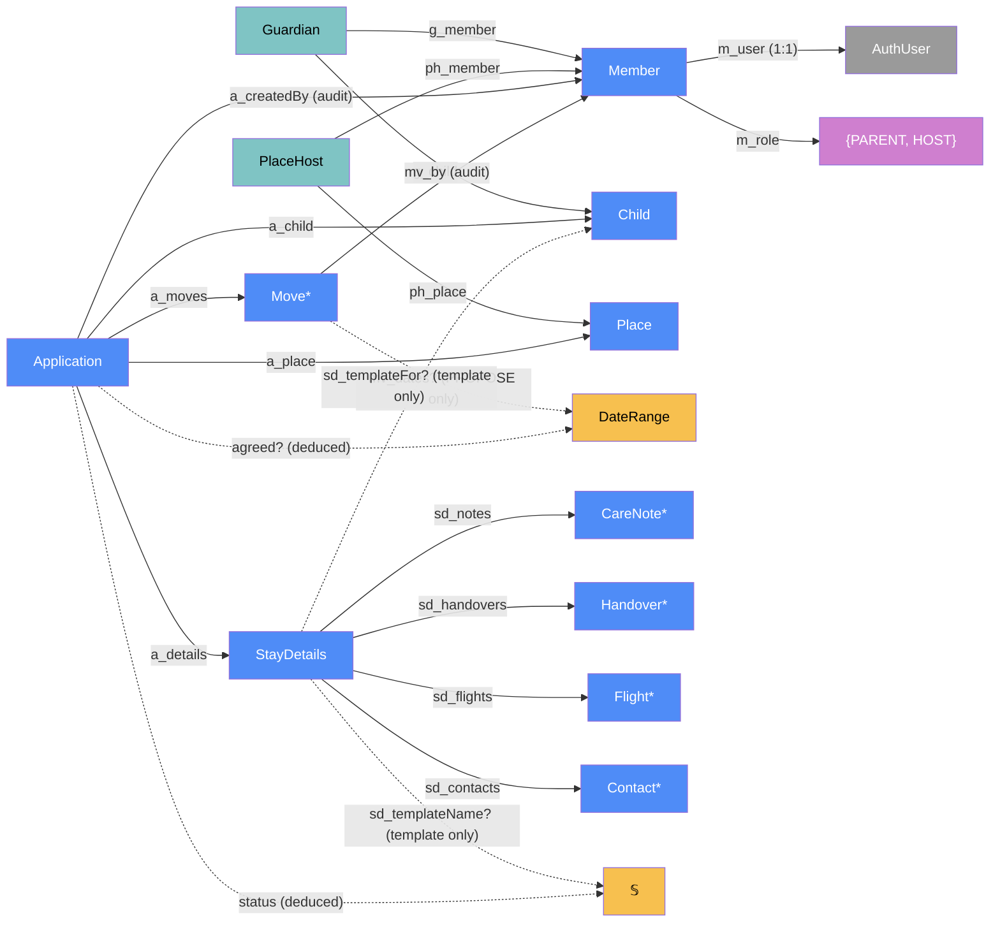
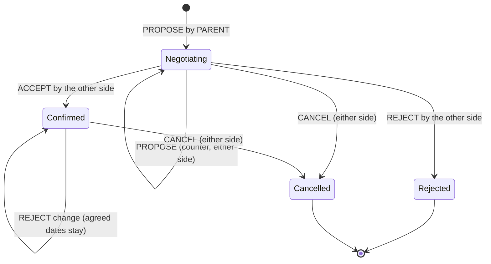

# Stayover — categorical model

> Model-first (FRAMEWORK §2/§4). Intended specification for this component; the
> code realises it (see IMPLEMENTATION.md). Source of record: this file — no code
> exists yet (greenfield, 2026-09-23).

## 1. Overview

The domain core of lyanne-visa. One deployment serves one family. People
**register** themselves with exactly one role — **parent** or **host**; with the
family **join code** they are active immediately, without it they wait for the
admin's approval. An **admin** account (configured by email, never registered)
oversees accounts. Parents add their **children**; hosts add their homes
(**places**). A parent submits an **application** for a
child to stay at a place over a date range; the place's hosts approve, reject or
counter with other dates; nothing is confirmed until **both sides agree** on the
same dates. Each application carries its own **stay details** — care notes,
drop-off/pick-up handovers, the parents' flights and contacts — which parents can
save as, or fill from, a reusable **template**. v1 has one child, one place and one
pair of grandparents; the model is open-ended in all three.

## 2. Why

Three reductions fall straight out of the model and each removes a table, a
screen or a sync job:

- **Negotiation is one log, not a status column plus a counter-offer table.** An
  application is a free monoid of `Move`s. "Host approves" and "parent accepts the
  host's counter" are the *same* morphism (`ACCEPT` by the side that did not make
  the open proposal), so there is one code path for both. Status, the agreed dates
  and whose turn it is are **deduced** by folding the log — never stored, never
  out of sync.
- **An account is a Member with one role.** A `Member` is the profile of a
  signed-in identity with `m_role ∈ {PARENT, HOST}`, chosen at registration.
  Links to children (`Guardian`) and places (`PlaceHost`) must agree with the
  role, so "no one is on both sides of an application" is structural, not a
  runtime check.
- **The admin is configuration, not family data.** `admin?` is a predicate on the
  signed-in identity (an email on the deployment's admin list). The admin has no `Member` profile and
  therefore no side — it can oversee everything but never take part in a
  negotiation.
- **Single tenant.** One deployment is one family, so there is no `Family` object
  and no tenant column; privacy comes from visibility-by-side (rule 12).
- **A template is StayDetails without an application** (§3). One object,
  discriminated by `sd_templateName?`; one editor, one set of child lists.
  Templates are anchored on the child (§3 anchor corollary), so a child's parents
  share them.
- **Side is deduced per application.** Which side a member acts on in an
  application is deduced from `Guardian`/`PlaceHost`, which is what makes more
  places, hosts and children free later.

## 3. Core category

`AuthUser` is owned by the auth provider (grey — not authoritative here).
`Settings` (the join code) and the admin list are deployment configuration, not
family data, and are not drawn.
Scalar fields of each entity are listed in the table, not drawn.

## 4. Morphism table

### Accounts, children and places

| Morphism | Signature | Partiality | Semantics |
| --- | --- | --- | --- |
| `m_user` | `Member → AuthUser` | Total, injective | the signed-in identity this profile belongs to (rule 16) |
| `m_email` | `Member → 𝕊` | Deduced | `email ∘ m_user`, lower-cased — not copied |
| `m_name` | `Member → 𝕊` | Total | display name ("Grandma") |
| `m_role` | `Member → {PARENT, HOST}` | Total | chosen at registration; changed only by the admin, only while the member has no links (rule 18) |
| `m_status` | `Member → {WAITING, ACTIVE, DEACTIVATED}` | Total | `ACTIVE` at registration with the join code, else `WAITING`; the admin moves it (rules 1, 17, 21) |
| `m_statusAt` | `Member → Instant` | Total | when `m_status` last changed (audit) |
| `c_name` | `Child → 𝕊` | Total | |
| `c_createdBy` | `Child → Member` | Total | audit only |
| `p_name` | `Place → 𝕊` | Total | "Grandma & Grandpa's" |
| `p_address?` | `Place → 𝕊` | Partial | visibility restricted (rule 12); used as calendar event location |
| `p_tz` | `Place → 𝕊` | Total | IANA time zone; all stay dates are local to the place |
| `p_createdBy` | `Place → Member` | Total | audit only |
| `g_member`, `g_child` | `Guardian → Member`, `Guardian → Child` | Total | span: member is a parent of child; `m_role ∘ g_member = PARENT` (rule 11) |
| `ph_member`, `ph_place` | `PlaceHost → Member`, `PlaceHost → Place` | Total | span: member hosts at place; `m_role ∘ ph_member = HOST` (rule 11) |
| `side` | `Member × Application → Side` | Deduced, Partial | `PARENT` iff `(m, a_child a) ∈ Guardian`; `HOST` iff `(m, a_place a) ∈ PlaceHost`; undefined otherwise or when `m_status ≠ ACTIVE` |
| `admin?` | `AuthUser → 𝔹` | Deduced | `lower(email) ∈ AdminList` — deployment configuration seeded at setup, not editable in the app |
| `activeMember?` | `AuthUser → Member` | Deduced, Partial | `m_user⁻¹(u)` when `m_status = ACTIVE`; otherwise the registration, waiting or deactivated page (or admin area, if `admin?`) |
| `joinCode` | `Settings → Secret` | Total | the family join code, stored only as a salted hash; set and rotated by the admin (rule 21) |

### Application and negotiation

| Morphism | Signature | Partiality | Semantics |
| --- | --- | --- | --- |
| `a_child` | `Application → Child` | Total | who is staying |
| `a_place` | `Application → Place` | Total | where |
| `a_createdBy` | `Application → Member` | Total | audit only (§3 corollary — not an access path) |
| `a_createdAt` | `Application → Instant` | Total | |
| `a_moves` | `Application → Move*` | Total | append-only, non-empty negotiation log |
| `a_details` | `Application → StayDetails` | Total | 1:1, owned; created with the application |
| `mv_kind` | `Move → {PROPOSE, ACCEPT, REJECT, CANCEL}` | Total | |
| `mv_side` | `Move → {PARENT, HOST}` | Total | `side(mv_by, a)` snapshotted at write time (rule 5) |
| `mv_by` | `Move → Member` | Total | audit: who acted |
| `mv_at` | `Move → Instant` | Total | |
| `mv_dates?` | `Move → DateRange` | Partial | defined iff `mv_kind = PROPOSE` |
| `mv_note?` | `Move → 𝕊` | Partial | optional message to the other side |
| `dr_start`, `dr_end` | `DateRange → Date` | Total | drop-off day, pick-up day; `start < end`; nights = `[start, end)` |
| `open?` | `Application → Move` | Deduced, Partial | the latest `PROPOSE` with no `ACCEPT`/`REJECT`/`CANCEL` after it |
| `awaiting?` | `Application → Side` | Deduced, Partial | `opposite ∘ mv_side ∘ open?` — whose turn it is |
| `agreed?` | `Application → DateRange` | Deduced, Partial | `mv_dates` of the latest `PROPOSE` that was answered by `ACCEPT`, unless a `CANCEL` follows |
| `dates` | `Application → DateRange` | Deduced | `agreed? ?? mv_dates(open?)` — what to display |
| `status` | `Application → Status` | Deduced | fold of `a_moves`, §5 |
| `revision` | `Application → ℕ` | Deduced | number of moves that changed `agreed?` (an `ACCEPT` or a `CANCEL` after agreement); consumed by Delivery as the calendar sequence number |

### Stay details and templates

| Morphism | Signature | Partiality | Semantics |
| --- | --- | --- | --- |
| `sd_templateFor?` | `StayDetails → Child` | Partial | defined ⟺ template; anchors it on the child, shared by the child's parents (rule 7) |
| `sd_templateName?` | `StayDetails → 𝕊` | Partial | defined ⟺ template (rule 7) |
| `sd_notes` | `StayDetails → CareNote*` | Total | ordered |
| `sd_handovers` | `StayDetails → Handover*` | Total | at most one per kind |
| `sd_flights` | `StayDetails → Flight*` | Total | |
| `sd_contacts` | `StayDetails → Contact*` | Total | emergency contacts, parents' overseas numbers |
| `cn_topic`, `cn_body` | `CareNote → 𝕊` | Total | e.g. "Bedtime", "Allergies", "Medicine", "School" |
| `ho_kind` | `Handover → {DROP_OFF, PICK_UP}` | Total | drop-off and pick-up are one object (§3) |
| `ho_time?` | `Handover → TimeOfDay` | Partial | local to `p_tz` |
| `ho_location?` | `Handover → 𝕊` | Partial | defaults to the place when undefined |
| `ho_by?` | `Handover → 𝕊` | Partial | who drives — free text (may be a non-member) |
| `ho_date` | `Handover → Date` | Deduced | `dr_start ∘ dates` for `DROP_OFF`, `dr_end ∘ dates` for `PICK_UP`; undefined on a template |
| `fl_leg` | `Flight → {OUTBOUND, RETURN}` | Total | |
| `fl_number` | `Flight → 𝕊` | Total | e.g. "SQ 318" |
| `fl_from`, `fl_to` | `Flight → 𝕊` | Total | airports |
| `fl_departs`, `fl_arrives` | `Flight → ZonedDateTime` | Total | each in its own airport's zone |
| `ct_name`, `ct_relationship`, `ct_phone` | `Contact → 𝕊` | Total | |
| `ct_email?`, `ct_notes?` | `Contact → 𝕊` | Partial | |

## 5. Functors

### Negotiation state machine — `status : Move* → Status`

`Status = (phase, awaiting?)` with `phase ∈ {NEGOTIATING, CONFIRMED, REJECTED, CANCELLED}`.

| Last relevant move | `agreed?` | `phase` | `awaiting?` |
| --- | --- | --- | --- |
| `PROPOSE` by S, no agreement yet | — | `NEGOTIATING` | `opposite S` |
| `ACCEPT` | the accepted dates | `CONFIRMED` | — |
| `PROPOSE` by S after agreement | unchanged | `CONFIRMED` | `opposite S` (change pending) |
| `REJECT`, agreement exists | unchanged | `CONFIRMED` | — |
| `REJECT`, no agreement | — | `REJECTED` (terminal) | — |
| `CANCEL` | — | `CANCELLED` (terminal) | — |

## 6. Composition rules

1. **Self-service registration** (decided 2026-09-24). A signed-in identity that
   is not `admin?` and has no `Member` may create exactly one `Member` by choosing
   a role and a name, optionally entering the family join code. A correct code
   ⟹ `m_status = ACTIVE`; no code ⟹ `WAITING` until the admin approves
   (`WAITING → ACTIVE`) or declines (`WAITING → DEACTIVATED`).
2. **Proposal shape.** `mv_dates?` defined ⟺ `mv_kind = PROPOSE`; `dr_start < dr_end`.
3. **Parents open.** `a_moves[0]` is `PROPOSE` with `mv_side = PARENT`.
4. **Move legality** (the functor in §5): `ACCEPT`/`REJECT` require `open?` defined
   and `mv_side ≠ mv_side(open?)` — nobody accepts their own proposal, so an
   agreement always carries both sides' consent. `PROPOSE`/`CANCEL` require phase
   ∈ {NEGOTIATING, CONFIRMED}. No move after a terminal phase.
5. **Side is snapshotted.** `mv_side(mv) = side(mv_by(mv), a)` at write time. Stored
   (not deduced at read time) because membership may change later and the log is
   history — a snapshot, not a cache; it never needs re-syncing.
6. **No double-booking.** For two applications of the same child, their `agreed?`
   ranges (half-open) do not overlap. Checked on `ACCEPT`.
7. **Template discriminator.** `sd_templateName?` defined ⟺ `sd_templateFor?`
   defined ⟺ no `Application` has `a_details` pointing at it.
8. **Templates are copied, deliberately.** Applying a template copies its child
   lists into the application's `StayDetails`; "save as template" copies the other
   way. *Note (§6.6 exception to the §3 deduce-don't-copy corollary):* a stay's
   details must not change when a template is later edited, so a snapshot is the
   intended semantics, not a cache.
9. **Details are not negotiated.** Either side may edit `StayDetails` while the
   phase is non-terminal; only dates require mutual acceptance. *(Decided
   2026-09-23 — O1 resolved.)*
10. **Owners create, the admin oversees.** A parent who adds a child becomes its
    guardian; a host who adds a place becomes its host. A child's guardians may add
    another registered parent (found by exact email) as co-guardian; a place's
    hosts may add another registered host as co-host, and either may remove a
    co-guardian / co-host link. The admin may rename, edit and relink anything
    (within rules 11, 14 and 20) but does not create children or places.
11. **Links agree with role.** `m_role ∘ g_member = PARENT` and
    `m_role ∘ ph_member = HOST`. Hence no member is both guardian of `a_child` and
    host of `a_place`, and `side` is a function by construction.
12. **Visibility is by side** (O2, decided 2026-09-23). A member reads an
    application — and its `StayDetails` and moves — iff `side(m, a)` is defined:
    parents of the child and hosts of the place, nobody else. A child is visible
    to its guardians and to hosts of places it has applications at. Every active
    member sees each place's name and time zone (parents need them to apply), but
    **`p_address?` only to the place's hosts and to parents with an application at
    that place** — the safeguard that makes open registration acceptable.
    Templates are visible to the guardians of `sd_templateFor?`. The admin reads
    everything and takes part in nothing.
13. **Hard delete only while unanswered.** A parent may permanently delete an
    application iff every move in `a_moves` has `mv_side = PARENT` (no host has
    responded). This removes the application, its moves and its `StayDetails`,
    and emits `ApplicationDeleted` so the hosts are told the request was
    withdrawn. Otherwise "delete" means `CANCEL`, which keeps the history.
14. **Every child has a parent.** Each `Child` has at least one `Guardian` link.
15. **The admin is not a member.** `admin?(u) ⟹` no `Member` has `m_user = u`; the
    admin cannot register.
16. **One profile per identity.** `m_user` is injective.
17. **Only ACTIVE members exist to the app.** A `WAITING` or `DEACTIVATED` member
    cannot see or do anything, cannot be found by co-parent / co-host lookup, and is
    excluded from `participants` for future emails; every audit reference (moves,
    created-by) is kept. The admin moves `ACTIVE ⇄ DEACTIVATED` and
    `WAITING → ACTIVE | DEACTIVATED`; nothing returns to `WAITING`.
18. **Role changes are admin-only and link-free.** `m_role` changes only by the
    admin and only while the member has no `Guardian`/`PlaceHost` links.
19. **Emails compare case-insensitively** — the admin list and the co-guardian
    / co-host lookup both use the lower-cased address.
20. **Every place has a host.** Each `Place` has at least one `PlaceHost` link.
21. **Join code.** The code is compared against its salted hash only. A wrong code is
    refused with a message (the person may retry or register without it); after 5
    wrong attempts by one identity, further codes from it are ignored and it can
    only join the waiting list. With no code set, everyone who registers waits.
    Changing the code never affects existing members.

### Permissions (O2) — CRUD read through the model

| Action | Parent side | Host side | Realised as |
| --- | --- | --- | --- |
| Create application | ✅ | ❌ | first `PROPOSE` (rule 3) |
| Read application, details, history | ✅ | ✅ | rule 12 |
| Propose / counter dates | ✅ | ✅ | `PROPOSE` |
| Accept the other side's dates | ✅ | ✅ | `ACCEPT` (rule 4) |
| Edit stay details | ✅ | ✅ | rule 9 — no re-acceptance |
| Deny a request or change | ✅ | ✅ | `REJECT` of the open proposal |
| Cancel (before or after confirmation) | ✅ | ✅ | `CANCEL` — history kept, calendars cancelled |
| Permanently delete | ✅ only while unanswered | ❌ | rule 13 |
| Manage templates | ✅ | ❌ | rule 12 |

### Permissions — accounts, children and places

| Action | Parent | Host | Admin |
| --- | --- | --- | --- |
| Register (active with join code, else waiting) | ✅ as parent | ✅ as host | ❌ (configured) |
| Add a child | ✅ becomes its parent | ❌ | ❌ |
| Rename child · add/remove co-parent | its parents | ❌ | ✅ |
| Add a place | ❌ | ✅ becomes its host | ❌ |
| Edit place · add/remove co-host | ❌ | its hosts | ✅ |
| See a place's address | if applied there | its hosts | ✅ |
| List all accounts | ❌ | ❌ | ✅ |
| Approve / decline waiting accounts | ❌ | ❌ | ✅ (rule 17) |
| Deactivate / reactivate · change role | ❌ | ❌ | ✅ (rules 17–18) |
| Set or change the join code | ❌ | ❌ | ✅ (rule 21) |
| Negotiate applications | per table above | per table above | read-only |

## 7. Atoms owned (FRAMEWORK §4)

**Trn**

| Trn | `t_from → t_to` | Realising code |
| --- | --- | --- |
| `register ⊸` | `AuthUser × (role, name) → Member` | planned |
| `addChild ⊸` / `addPlace ⊸` | `Member × … → Child` / `Place` (creator linked) | planned |
| `linkGuardian ⊸` / `linkHost ⊸` | `Member × Member × Child/Place → Guardian/PlaceHost` | planned |
| `approve ⊸` / `decline ⊸` / `deactivate ⊸` / `reactivate ⊸` / `setRole ⊸` | admin: `Member → Member` (status or role transition) | planned |
| `setJoinCode ⊸` | admin: `𝕊 → Settings` (stores the hash) | planned |
| `checkJoinCode` | `Member × 𝕊 → 𝔹` (with attempt counting) | planned |
| `readAccount` | `AuthUser → activeMember? × status × admin? × attemptsLeft` — realises `activeMember?` for callers RLS hides from themselves (waiting, deactivated, unregistered, admin) | planned |
| `readEmails` | `Member* → 𝕊*` — realises the deduced `m_email` for the members the caller may see | planned |
| `homeDirectory` | `Place* → (name, p_tz)*` — the address-free projection of `Place` every active member reads (rule 12) | planned |
| `authorize` | `Member × Application → Side?` (= `side`) | planned |
| `validateMove` | `Move* × MoveCmd × Side → Move` or error | planned |
| `recordMove ⊸` | `Application × Move → Application` (append) | planned |
| `foldStatus` | `Move* → (Status, open?, agreed?, revision)` | planned |
| `checkOverlap` | `Child × DateRange → 𝔹` | planned |
| `applyTemplate ⊸` / `saveAsTemplate ⊸` | `StayDetails → StayDetails` (copy) | planned |
| `deleteApplication ⊸` | `Application → ApplicationDeleted` (rule 13) | planned |
| `render` | `ApplicationView → UI` | planned |

**Loc** — `Browser` (each member's phone or computer), `AppServer` (Netlify
serverless function running Next.js server actions), `Db` (Supabase Postgres),
`AuthProvider` (Supabase Auth).

**Trm**

| Trm | carries | `c_from → c_to` |
| --- | --- | --- |
| `t_command` | `MoveCmd` / `DetailsCmd` / `AccountCmd` | `Browser → AppServer` |
| `t_view` | `ApplicationView` | `AppServer → Browser` (reply only, §7.2) |
| `t_sql` | `Application`, `Move`, `StayDetails` rows | `AppServer ↔ Db` |
| `t_signin` | `Session` (JWT) | `AuthProvider → Browser → AppServer` |
| `t_stayover_event` | `StayoverEvent` | port to Delivery — see §8 |

**Placements (§4.2)** — `runsAt` is a relation here:

| Trn | Placements | Why |
| --- | --- | --- |
| `validateMove` | `Browser` (enable/disable buttons), `AppServer` (authoritative) | never trust the client (§7.2) |
| `checkOverlap` | `AppServer`, `Db` (exclusion constraint on agreed ranges) | the DB guarantees rule 6 under concurrent accepts |
| `authorize` | `AppServer`, `Db` (row-level security for rule 12) | defence in depth; RLS enforces visibility-by-side |
| `foldStatus` | `AppServer`, `Browser` (optimistic view) | same contract, two realisations |

## 8. Bridges to other components (ports)

| Boundary morphism | Signature | Stored? | Semantics |
| --- | --- | --- | --- |
| `t_stayover_event` | `Stayover → Delivery`, carries `StayoverEvent = MoveCommitted ⊕ ApplicationDeleted ⊕ MemberWaiting`; `MemberWaiting = (member name, role, email)` emitted when an account registers without the join code; `MoveCommitted = (Application, Move, before: Status, after: Status)`; `ApplicationDeleted = (application id, c_name, p_name, hosts: Member*, dates)` — a snapshot, since the application no longer exists | No — emitted after commit | Delivery decides notices and invites from it |
| `participants` | `Application → Member*` | Deduced | active members of `guardians(a_child) ∪ hosts(a_place)` — read by Delivery |
| `calendarFacts` | `Application → (agreed?, revision, phase, p_tz, p_address?, c_name, p_name)` | Deduced | everything Delivery needs to build an event; Delivery never re-derives status itself |

## 9. Coherence notes

- **Law 1 (placement honesty).** `validateMove` in the Browser reads `Move*` which
  arrives via `t_view`; the authoritative placement at `AppServer` re-reads it from
  `Db` inside the same transaction as `recordMove`.
- **Law 4 (dependency mediation).** Delivery depends on Stayover only through
  `t_stayover_event` and the deduced `participants`/`calendarFacts` — it never
  reads `Move*` or recomputes `status`.
- **Law 6 (runsAt is a relation).** Four Trns are multi-placed (§7 table); each pair
  realises one contract.
- **§3 sweep.** Admin is a predicate, not an object; account = `Member` + role (no
  separate Parent/Host tables); Template ⊂ StayDetails; counter-offer ⊂ Move;
  approve ≡ accept; drop-off ≡ pick-up (one `Handover` + kind). No parallel objects.
