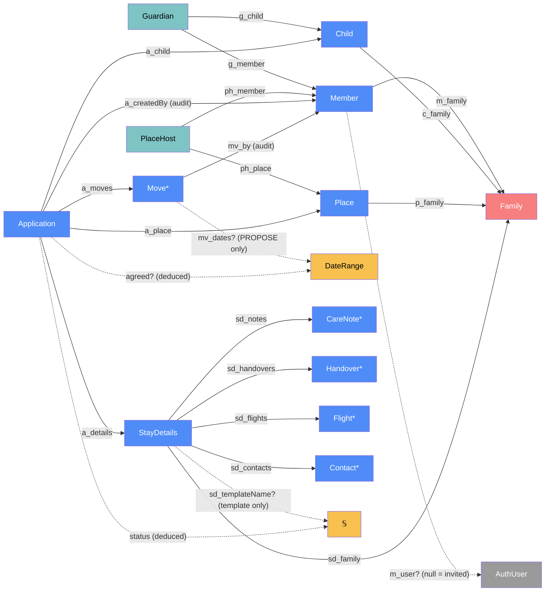
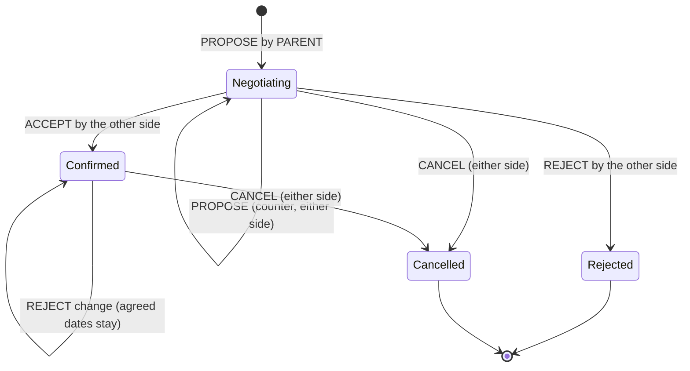

# Stayover — categorical model

> Model-first (FRAMEWORK §2/§4). Intended specification for this component; the
> code realises it (see IMPLEMENTATION.md). Source of record: this file — no code
> exists yet (greenfield, 2026-09-23).

## 1. Overview

The domain core of lyanne-visa. A **family** has **members**, **children** and
**places** (where stayovers happen). A parent submits an **application** for a
child to stay at a place over a date range; the place's hosts approve, reject or
counter with other dates; nothing is confirmed until **both sides agree** on the
same dates. Each application carries its own **stay details** — care notes,
drop-off/pick-up handovers, the parents' flights and contacts — which parents can
save as, or fill from, a reusable **template**. v1 has one child, one place and one
pair of grandparents; the model is open-ended in all three.

## 2. Why

Three reductions fall straight out of the model and each removes a table, a
screen or a sync job:

- **Negotiation is one log, not a status column plus a counter-offer table.** An
  application is a free monoid of `Move`s. "Host approves" and "parent accepts the
  host's counter" are the *same* morphism (`ACCEPT` by the side that did not make
  the open proposal), so there is one code path for both. Status, the agreed dates
  and whose turn it is are **deduced** by folding the log — never stored, never
  out of sync.
- **An invitation is a Member without a user** (§3). A pending invite is
  `Member` with `m_user?` undefined, so there is no `Invitation` object, no
  invite→member translator, and invited people can receive calendar invites
  before they ever sign in.
- **A template is StayDetails without an application** (§3). One object,
  discriminated by `sd_templateName?`; one editor, one set of child lists.
- **Roles are deduced, not stored.** "Host" = appears in `PlaceHost`; "parent" =
  appears in `Guardian`. Which side a member acts on is deduced per application,
  which is what makes more places, hosts and children free later.

## 3. Core category

`AuthUser` is owned by the auth provider (grey — not authoritative here).
Scalar fields of each entity are listed in the table, not drawn.

## 4. Morphism table

### Family structure

| Morphism | Signature | Partiality | Semantics |
| --- | --- | --- | --- |
| `f_name` | `Family → 𝕊` | Total | display name |
| `m_family` | `Member → Family` | Total | the tenant this member belongs to |
| `m_email` | `Member → 𝕊` | Total | unique within a family; the invite address and sign-in match key |
| `m_name` | `Member → 𝕊` | Total | display name ("Grandma Foo") |
| `m_user?` | `Member → AuthUser` | Partial | undefined while the invite is pending; bound on first sign-in with a matching email |
| `m_invitedBy?` | `Member → Member` | Partial | audit only; undefined for the founding member |
| `c_family` | `Child → Family` | Total | |
| `c_name` | `Child → 𝕊` | Total | |
| `p_family` | `Place → Family` | Total | |
| `p_name` | `Place → 𝕊` | Total | "Grandma & Grandpa's" |
| `p_address?` | `Place → 𝕊` | Partial | used as calendar event location |
| `p_tz` | `Place → 𝕊` | Total | IANA time zone; all stay dates are local to the place |
| `g_member`, `g_child` | `Guardian → Member`, `Guardian → Child` | Total | span: member is a parent/guardian of child (genuine many-to-many) |
| `ph_member`, `ph_place` | `PlaceHost → Member`, `PlaceHost → Place` | Total | span: member hosts at place (genuine many-to-many) |
| `side` | `Member × Application → Side` | Deduced, Partial | `HOST` iff `(m, a_place a) ∈ PlaceHost`; `PARENT` iff `(m, a_child a) ∈ Guardian`; undefined ⟹ member cannot act on `a` |

### Application and negotiation

| Morphism | Signature | Partiality | Semantics |
| --- | --- | --- | --- |
| `a_child` | `Application → Child` | Total | who is staying |
| `a_place` | `Application → Place` | Total | where |
| `a_createdBy` | `Application → Member` | Total | audit only (§3 corollary — not an access path) |
| `a_createdAt` | `Application → Instant` | Total | |
| `a_moves` | `Application → Move*` | Total | append-only, non-empty negotiation log |
| `a_details` | `Application → StayDetails` | Total | 1:1, owned; created with the application |
| `mv_kind` | `Move → {PROPOSE, ACCEPT, REJECT, CANCEL}` | Total | |
| `mv_side` | `Move → {PARENT, HOST}` | Total | `side(mv_by, a)` snapshotted at write time (rule 5) |
| `mv_by` | `Move → Member` | Total | audit: who acted |
| `mv_at` | `Move → Instant` | Total | |
| `mv_dates?` | `Move → DateRange` | Partial | defined iff `mv_kind = PROPOSE` |
| `mv_note?` | `Move → 𝕊` | Partial | optional message to the other side |
| `dr_start`, `dr_end` | `DateRange → Date` | Total | drop-off day, pick-up day; `start < end`; nights = `[start, end)` |
| `open?` | `Application → Move` | Deduced, Partial | the latest `PROPOSE` with no `ACCEPT`/`REJECT`/`CANCEL` after it |
| `awaiting?` | `Application → Side` | Deduced, Partial | `opposite ∘ mv_side ∘ open?` — whose turn it is |
| `agreed?` | `Application → DateRange` | Deduced, Partial | `mv_dates` of the latest `PROPOSE` that was answered by `ACCEPT`, unless a `CANCEL` follows |
| `dates` | `Application → DateRange` | Deduced | `agreed? ?? mv_dates(open?)` — what to display |
| `status` | `Application → Status` | Deduced | fold of `a_moves`, §5 |
| `revision` | `Application → ℕ` | Deduced | number of moves that changed `agreed?` (an `ACCEPT` or a `CANCEL` after agreement); consumed by Delivery as the calendar sequence number |

### Stay details and templates

| Morphism | Signature | Partiality | Semantics |
| --- | --- | --- | --- |
| `sd_family` | `StayDetails → Family` | Total | |
| `sd_templateName?` | `StayDetails → 𝕊` | Partial | defined ⟺ this is a template (rule 7) |
| `sd_notes` | `StayDetails → CareNote*` | Total | ordered |
| `sd_handovers` | `StayDetails → Handover*` | Total | at most one per kind |
| `sd_flights` | `StayDetails → Flight*` | Total | |
| `sd_contacts` | `StayDetails → Contact*` | Total | emergency contacts, parents' overseas numbers |
| `cn_topic`, `cn_body` | `CareNote → 𝕊` | Total | e.g. "Bedtime", "Allergies", "Medicine", "School" |
| `ho_kind` | `Handover → {DROP_OFF, PICK_UP}` | Total | drop-off and pick-up are one object (§3) |
| `ho_time?` | `Handover → TimeOfDay` | Partial | local to `p_tz` |
| `ho_location?` | `Handover → 𝕊` | Partial | defaults to the place when undefined |
| `ho_by?` | `Handover → 𝕊` | Partial | who drives — free text (may be a non-member) |
| `ho_date` | `Handover → Date` | Deduced | `dr_start ∘ dates` for `DROP_OFF`, `dr_end ∘ dates` for `PICK_UP`; undefined on a template |
| `fl_leg` | `Flight → {OUTBOUND, RETURN}` | Total | |
| `fl_number` | `Flight → 𝕊` | Total | e.g. "SQ 318" |
| `fl_from`, `fl_to` | `Flight → 𝕊` | Total | airports |
| `fl_departs`, `fl_arrives` | `Flight → ZonedDateTime` | Total | each in its own airport's zone |
| `ct_name`, `ct_relationship`, `ct_phone` | `Contact → 𝕊` | Total | |
| `ct_email?`, `ct_notes?` | `Contact → 𝕊` | Partial | |

## 5. Functors

### Negotiation state machine — `status : Move* → Status`

`Status = (phase, awaiting?)` with `phase ∈ {NEGOTIATING, CONFIRMED, REJECTED, CANCELLED}`.

| Last relevant move | `agreed?` | `phase` | `awaiting?` |
| --- | --- | --- | --- |
| `PROPOSE` by S, no agreement yet | — | `NEGOTIATING` | `opposite S` |
| `ACCEPT` | the accepted dates | `CONFIRMED` | — |
| `PROPOSE` by S after agreement | unchanged | `CONFIRMED` | `opposite S` (change pending) |
| `REJECT`, agreement exists | unchanged | `CONFIRMED` | — |
| `REJECT`, no agreement | — | `REJECTED` (terminal) | — |
| `CANCEL` | — | `CANCELLED` (terminal) | — |

## 6. Composition rules

1. **Same tenant.** `c_family ∘ a_child = p_family ∘ a_place = sd_family ∘ a_details`.
2. **Proposal shape.** `mv_dates?` defined ⟺ `mv_kind = PROPOSE`; `dr_start < dr_end`.
3. **Parents open.** `a_moves[0]` is `PROPOSE` with `mv_side = PARENT`.
4. **Move legality** (the functor in §5): `ACCEPT`/`REJECT` require `open?` defined
   and `mv_side ≠ mv_side(open?)` — nobody accepts their own proposal, so an
   agreement always carries both sides' consent. `PROPOSE`/`CANCEL` require phase
   ∈ {NEGOTIATING, CONFIRMED}. No move after a terminal phase.
5. **Side is snapshotted.** `mv_side(mv) = side(mv_by(mv), a)` at write time. Stored
   (not deduced at read time) because membership may change later and the log is
   history — a snapshot, not a cache; it never needs re-syncing.
6. **No double-booking.** For two applications of the same child, their `agreed?`
   ranges (half-open) do not overlap. Checked on `ACCEPT`.
7. **Template discriminator.** `sd_templateName?` defined ⟺ no `Application` has
   `a_details` pointing at it.
8. **Templates are copied, deliberately.** Applying a template copies its child
   lists into the application's `StayDetails`; "save as template" copies the other
   way. *Note (§6.6 exception to the §3 deduce-don't-copy corollary):* a stay's
   details must not change when a template is later edited, so a snapshot is the
   intended semantics, not a cache.
9. **Details are not negotiated.** Either side may edit `StayDetails` while the
   phase is non-terminal; only dates require mutual acceptance. *(Decided
   2026-09-23 — O1 resolved.)*
10. **Invite binding.** On sign-in, `AuthUser` binds to the pending `Member` of the
    same email (`m_user?` goes from undefined to defined, once). A member with
    `m_user?` undefined cannot act.
11. **One side per application.** No member is both `Guardian` of `a_child` and
    `PlaceHost` of `a_place` — otherwise `side` is not a function.
12. **Visibility is by side** (O2, decided 2026-09-23). A member reads an
    application — and its `StayDetails` and moves — iff `side(m, a)` is defined:
    parents of the child and hosts of the place, nobody else. Templates are read
    and written by members who are a `Guardian` in the template's family. All
    reads and writes stay inside `m_family` (tenant wall).
13. **Hard delete only while unanswered.** A parent may permanently delete an
    application iff every move in `a_moves` has `mv_side = PARENT` (no host has
    responded). This removes the application, its moves and its `StayDetails`,
    and emits `ApplicationDeleted` so the hosts are told the request was
    withdrawn. Otherwise "delete" means `CANCEL`, which keeps the history.

### Permissions (O2) — CRUD read through the model

| Action | Parent side | Host side | Realised as |
| --- | --- | --- | --- |
| Create application | ✅ | ❌ | first `PROPOSE` (rule 3) |
| Read application, details, history | ✅ | ✅ | rule 12 |
| Propose / counter dates | ✅ | ✅ | `PROPOSE` |
| Accept the other side's dates | ✅ | ✅ | `ACCEPT` (rule 4) |
| Edit stay details | ✅ | ✅ | rule 9 — no re-acceptance |
| Deny a request or change | ✅ | ✅ | `REJECT` of the open proposal |
| Cancel (before or after confirmation) | ✅ | ✅ | `CANCEL` — history kept, calendars cancelled |
| Permanently delete | ✅ only while unanswered | ❌ | rule 13 |
| Manage templates | ✅ | ❌ | rule 12 |

## 7. Atoms owned (FRAMEWORK §4)

**Trn**

| Trn | `t_from → t_to` | Realising code |
| --- | --- | --- |
| `inviteMember ⊸` | `Member × InviteCmd → Member` (pending) | planned |
| `bindUser ⊸` | `AuthUser → Member` | planned |
| `authorize` | `Member × Application → Side?` (= `side`) | planned |
| `validateMove` | `Move* × MoveCmd × Side → Move` or error | planned |
| `recordMove ⊸` | `Application × Move → Application` (append) | planned |
| `foldStatus` | `Move* → (Status, open?, agreed?, revision)` | planned |
| `checkOverlap` | `Child × DateRange → 𝔹` | planned |
| `applyTemplate ⊸` / `saveAsTemplate ⊸` | `StayDetails → StayDetails` (copy) | planned |
| `deleteApplication ⊸` | `Application → ApplicationDeleted` (rule 13) | planned |
| `render` | `ApplicationView → UI` | planned |

**Loc** — `Browser` (each member's phone or computer), `AppServer` (Vercel
serverless function running Next.js server actions), `Db` (Supabase Postgres),
`AuthProvider` (Supabase Auth).

**Trm**

| Trm | carries | `c_from → c_to` |
| --- | --- | --- |
| `t_command` | `MoveCmd` / `DetailsCmd` / `InviteCmd` | `Browser → AppServer` |
| `t_view` | `ApplicationView` | `AppServer → Browser` (reply only, §7.2) |
| `t_sql` | `Application`, `Move`, `StayDetails` rows | `AppServer ↔ Db` |
| `t_signin` | `Session` (JWT) | `AuthProvider → Browser → AppServer` |
| `t_stayover_event` | `StayoverEvent` | port to Delivery — see §8 |

**Placements (§4.2)** — `runsAt` is a relation here:

| Trn | Placements | Why |
| --- | --- | --- |
| `validateMove` | `Browser` (enable/disable buttons), `AppServer` (authoritative) | never trust the client (§7.2) |
| `checkOverlap` | `AppServer`, `Db` (exclusion constraint on agreed ranges) | the DB guarantees rule 6 under concurrent accepts |
| `authorize` | `AppServer`, `Db` (row-level security for rule 12) | defence in depth; RLS enforces visibility-by-side |
| `foldStatus` | `AppServer`, `Browser` (optimistic view) | same contract, two realisations |

## 8. Bridges to other components (ports)

| Boundary morphism | Signature | Stored? | Semantics |
| --- | --- | --- | --- |
| `t_stayover_event` | `Stayover → Delivery`, carries `StayoverEvent = MoveCommitted ⊕ ApplicationDeleted`; `MoveCommitted = (Application, Move, before: Status, after: Status)`; `ApplicationDeleted = (application id, c_name, p_name, hosts: Member*, dates)` — a snapshot, since the application no longer exists | No — emitted after commit | Delivery decides notices and invites from it |
| `participants` | `Application → Member*` | Deduced | `guardians(a_child) ∪ hosts(a_place)` — read by Delivery |
| `calendarFacts` | `Application → (agreed?, revision, phase, p_tz, p_address?, c_name, p_name)` | Deduced | everything Delivery needs to build an event; Delivery never re-derives status itself |

## 9. Coherence notes

- **Law 1 (placement honesty).** `validateMove` in the Browser reads `Move*` which
  arrives via `t_view`; the authoritative placement at `AppServer` re-reads it from
  `Db` inside the same transaction as `recordMove`.
- **Law 4 (dependency mediation).** Delivery depends on Stayover only through
  `t_stayover_event` and the deduced `participants`/`calendarFacts` — it never
  reads `Move*` or recomputes `status`.
- **Law 6 (runsAt is a relation).** Four Trns are multi-placed (§7 table); each pair
  realises one contract.
- **§3 sweep.** Invitation ⊂ Member, Template ⊂ StayDetails, counter-offer ⊂ Move,
  approve ≡ accept, drop-off ≡ pick-up (one `Handover` + kind). No parallel objects.
